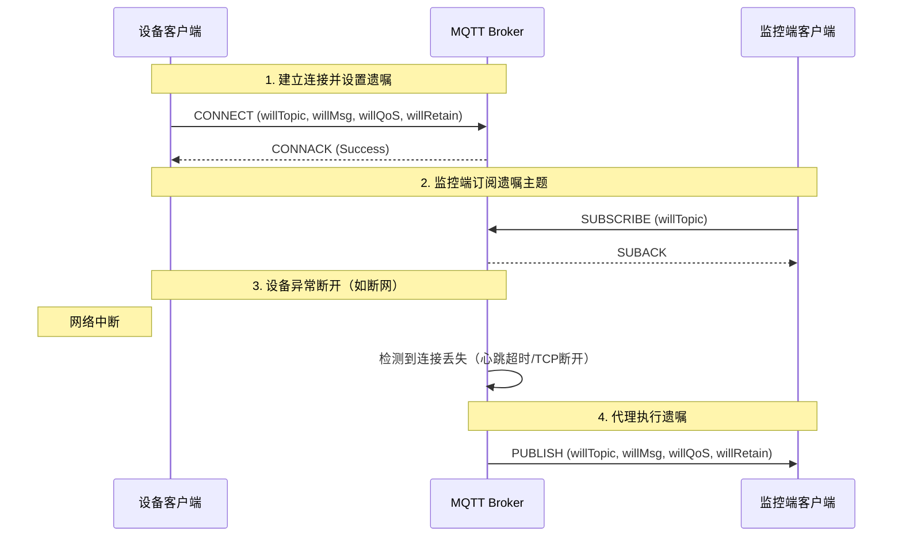

# MQTT遗嘱消息：设备“临终遗言”的妙用，实现优雅的掉线通知

在物联网（IoT）系统中，设备的网络连接并不总是稳定可靠的。设备可能因电量耗尽、信号丢失、硬件故障或网络波动而意外断开与MQTT代理（Broker）的连接。对于系统监控端而言，如何及时、准确地感知到这些“静默”的离线，是一个关键的挑战。简单地依赖心跳超时进行判断，往往存在延迟且逻辑复杂。幸运的是，MQTT协议内置了一个优雅的解决方案——**遗嘱消息（Last Will and Testament， 简称LWT或Will Message）**。它就像是设备在连接时预先立下的一份“遗嘱”，一旦发生非正常断开，代理便会自动执行这份遗嘱，向相关方发出“最后的消息”。

## 一、什么是遗嘱消息？

遗嘱消息是MQTT协议的一个核心特性，允许客户端在**建立连接时**就向代理（Broker）注册一个预先定义好的消息。这个“遗嘱”被代理暂存起来，并不会立即发布。

触发条件是：**当代理检测到该客户端非正常断开连接（即客户端没有发送DISCONNECT报文就失去了连接）时**，代理会自动将这份遗嘱消息发布到客户端预先指定的主题（Will Topic）上。这样，订阅了该主题的其他客户端（通常是监控后端或管理平台）就能立即得知该设备已异常离线。

### 核心概念解析：
*   **遗嘱主题（Will Topic）**：遗嘱消息将被发布到的主题路径，例如 `device/001/status`。
*   **遗嘱消息（Will Payload）**：遗嘱的内容，通常是表示离线状态的字符串，如 `"offline"`、`"{"status":"lost"}"`。
*   **遗嘱QoS（Will QoS）**：发布遗嘱消息时使用的服务质量等级，保证遗嘱的送达可靠性。
*   **遗嘱保留标志（Will Retain）**：如果设置为`true`，遗嘱消息将成为该主题的保留消息，新订阅者能立即收到最后的状态。

## 二、遗嘱消息的工作原理

让我们通过一个时序图来清晰地理解其工作流程：



**关键点**：
1.  **设置时机**：遗嘱信息只在`CONNECT`报文中设置，连接建立后无法修改。
2.  **触发条件**：**仅当连接非正常中断时触发**。如果客户端主动发送了`DISCONNECT`报文，代理知道这是计划内的断开，便不会发布遗嘱。
3.  **执行方**：遗嘱消息的发布是由**代理（Broker）** 主动执行的，不依赖于离线设备。这保证了即使设备完全宕机，通知也能发出。

## 三、如何配置遗嘱消息（代码示例）

下面我们使用流行的 `Eclipse Paho` 客户端库，展示在Python和JavaScript中如何配置遗嘱消息。

### Python 示例 (Paho-MQTT)

```python
import paho.mqtt.client as mqtt

def on_connect(client, userdata, flags, rc):
    if rc == 0:
        print("Connected successfully!")
    else:
        print(f"Connect failed with code {rc}")

# 创建客户端实例
client_id = "device_sensor_001"
client = mqtt.Client(client_id=client_id, protocol=mqtt.MQTTv311)

# 在连接前设置遗嘱消息
will_topic = "device/001/status"
will_payload = "offline"
will_qos = 1
will_retain = True

client.will_set(will_topic, will_payload, will_qos, will_retain)

# 设置回调函数
client.on_connect = on_connect

# 连接到代理
client.connect("broker.emqx.io", 1883, 60)

# 保持网络循环，发布正常数据...
client.loop_forever()
```

### JavaScript 示例 (MQTT.js)

```javascript
const mqtt = require('mqtt');

// 连接选项，其中包含遗嘱消息配置
const options = {
    clientId: 'web_client_monitor',
    clean: true,
    connectTimeout: 4000,
    // 遗嘱消息配置
    will: {
        topic: 'device/001/status',
        payload: JSON.stringify({ status: 'connection_lost', timestamp: Date.now() }),
        qos: 1,
        retain: true
    }
};

// 连接到代理
const client = mqtt.connect('mqtt://broker.emqx.io', options);

client.on('connect', () => {
    console.log('Connected to broker');
    // 订阅其他主题...
});

client.on('error', (err) => {
    console.error('Connection error:', err);
});
```

## 四、实际应用场景

遗嘱消息的应用极大地简化了设备状态管理逻辑。

### 场景一：实时设备状态看板
*   **需求**：在一个可视化大屏上，需要实时显示成千上万台在线设备的运行状态（在线/离线）。
*   **方案**：
    1.  每台设备连接时，设置遗嘱主题为 `device/{id}/status`，遗嘱消息为 `offline`，并设置`retain=true`。
    2.  设备正常上线后，立即向同一个主题发布一条 `online` 的保留消息。
    3.  监控前端只需订阅 `device/+/status` 主题，任何设备的上下线状态都会通过保留消息立即反映出来。遗嘱消息确保了异常离线时，状态能自动变更为`offline`。

### 场景二：异常掉线即时告警
*   **需求**：工厂里的关键传感器一旦掉线，需要立即通知运维人员，而不是等待下一次数据上报超时。
*   **方案**：
    1.  传感器设置遗嘱主题为 `alarm/device/{id}`，遗嘱消息包含详细的错误信息。
    2.  运维系统订阅 `alarm/device/+`。
    3.  当传感器因故障断电时，代理会立即向告警主题发布遗嘱，触发短信、邮件或钉钉告警。

### 场景三：会话持久化与清理
*   **需求**：在聊天应用中，用户A异常退出，需要让用户B看到“对方已离线”的提示。
*   **方案**：
    1.  每个用户客户端连接时，为自己设置一个遗嘱主题（如 `user/{id}/presence`）。
    2.  好友列表中的用户都订阅彼此的 presence 主题。
    3.  用户A异常退出，其遗嘱消息（如`"offline"`）发布，用户B的客户端收到后更新UI。

## 五、最佳实践与注意事项

1.  **合理设置遗嘱QoS**：根据业务重要性选择。关键设备监控建议使用QoS 1或2，确保遗嘱至少送达一次；对于可容忍偶尔丢失的非关键通知，QoS 0即可。
2.  **谨慎使用保留标志（Retain）**：`willRetain=true`非常有用，能让新订阅者立刻知道设备状态。但要避免在频繁变动的主题上使用保留消息，以免覆盖重要信息。
3.  **遗嘱内容设计**：遗嘱负载（Payload）应简洁明了，建议使用JSON格式包含更多上下文，如 `{"event": "connection_lost", "client_id": "xxx", "timestamp": 12345678}`。
4.  **与Clean Session配合理解**：
    *   `cleanSession=true`：会话不持久化，连接断开后所有订阅和遗嘱信息都会被清除。**遗嘱仍会触发**，但触发后遗嘱信息即被丢弃。
    *   `cleanSession=false`：会话持久化，遗嘱信息也会被保存。即使本次连接未触发，在客户端下次以相同Client ID连接（且cleanSession=false）之前，如果代理重启等导致连接断开，遗嘱**可能**会被触发（取决于代理实现）。逻辑较为复杂，需仔细测试。
5.  **不是万能的**：遗嘱消息的触发依赖于代理能检测到连接断开，这通常基于TCP层断开或心跳（Keep Alive）超时。因此，需要设置合理的心跳间隔。网络瞬时闪断又快速重连的情况，可能因未超过心跳超时时间而不会触发遗嘱。

## 结语

MQTT遗嘱消息是一种声明式、解耦的异常通知机制，将设备离线处理的逻辑从客户端转移到了代理，极大地提升了物联网系统的可靠性和可维护性。通过预先定义“遗言”，设备得以在“生命”终结时发出最后一声呐喊，确保系统其他部分能及时做出反应。在设计你的下一个IoT项目时，别忘了给设备们立下这份关键的“遗嘱”。