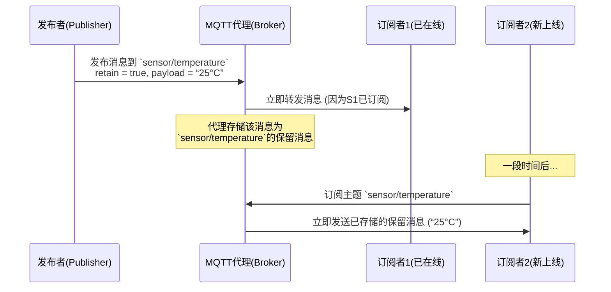

# MQTT保留消息揭秘：新订阅者如何立即获取“最后已知状态”

在物联网（IoT）和实时数据监控系统中，一个常见的挑战是：当一个新设备或客户端上线并订阅某个主题时，它如何能立即获取到该主题的“最后已知状态”，而不是需要等待下一次数据发布？MQTT协议通过其优雅的“保留消息”机制，完美地解决了这个问题。本文将深入探讨保留消息的工作原理、核心价值、实际应用场景，并通过代码示例展示如何实现它。

## 什么是保留消息？

保留消息是MQTT协议中一个独特且强大的特性。当发布者向一个主题发布消息时，可以设置一个`retain`标志位为`true`。MQTT代理（Broker）在接收到这样的消息后，不仅会将其分发给当前的订阅者，还会将这条消息**存储**起来，并与该主题**绑定**。

此后，**任何新的订阅者**在订阅这个主题时，代理会**立即**将这条最后存储的保留消息推送给它。每个主题最多只能有一条保留消息，新的保留消息会覆盖旧的。

## 为什么需要保留消息？核心价值

1.  **即时状态同步**：新上线的客户端无需等待下一个发布周期，即可获得关键数据（如设备最新传感器读数、开关状态、系统配置），实现“零等待”初始化。
2.  **降低发布者压力**：发布者无需为每个可能的新订阅者单独发送一次历史数据，只需在状态变化时发布一条保留消息即可。
3.  **简化客户端逻辑**：订阅者客户端不需要实现复杂的历史查询逻辑，订阅行为本身就能确保获取到最新状态。
4.  **提升系统响应性**：对于控制面板、仪表盘等应用，用户打开界面时能立刻看到数据，体验流畅。

## 工作机制详解

让我们通过一个时序图来清晰地理解保留消息的工作流程：



**关键点**：
*   保留消息存储在代理端，与发布者是否在线无关。
*   只有设置了`retain=true`的消息才会被保留。
*   向同一主题发送一条`payload`长度为0的保留消息，可以**清除**该主题的保留消息。

## 实际应用场景

### 1. 物联网设备状态监控
假设有一个智能温湿度传感器，每分钟向主题 `home/livingroom/climate` 发布一次数据。设置保留消息后，无论用户何时打开手机上的监控APP（即新订阅者），APP在订阅主题的瞬间就能收到房间当前的最新温湿度，并立即显示，无需空屏等待下一分钟的数据。

### 2. 设备配置与命令
服务器可以向主题 `device/123/config` 发布一条包含配置参数的保留消息。当设备 `123` 重启上线后，它订阅自己的配置主题，便能立即获取到最新的配置，完成自动配置。

### 3. 在线状态指示（Last Will 与保留消息结合）
虽然“最后遗言”常用于指示离线，但结合保留消息可以更好地表示状态。例如，设备上线时向 `device/123/status` 发布一条内容为 `“online”` 的保留消息。当它异常断开时，通过Last Will机制发布一条内容为 `“offline”` 的保留消息到同一主题。这样，任何查询该设备状态的客户端，订阅后立刻就能知道其是在线还是离线。

## 代码示例（使用 Paho MQTT Python 客户端）

以下示例演示了发布保留消息和接收保留消息的过程。

### 发布者：发布保留消息

```python
import paho.mqtt.client as mqtt
import time

broker = “broker.emqx.io”
port = 1883
topic = “demo/sensor/temperature”

def on_connect(client, userdata, flags, rc):
    if rc == 0:
        print(“发布者连接成功！”)
        # 模拟传感器读数并发布为保留消息
        temperature = 22.5
        payload = f“{temperature}”
        # 关键：设置 retain=True
        client.publish(topic, payload, qos=1, retain=True)
        print(f“已发布保留消息: {payload} 到主题 [{topic}]”)
        client.disconnect()
    else:
        print(f“连接失败， 代码: {rc}”)

client = mqtt.Client()
client.on_connect = on_connect

client.connect(broker, port, 60)
client.loop_forever()
```

### 订阅者：接收保留消息

```python
import paho.mqtt.client as mqtt

broker = “broker.emqx.io”
port = 1883
topic = “demo/sensor/temperature”

def on_connect(client, userdata, flags, rc):
    if rc == 0:
        print(“订阅者连接成功！”)
        # 订阅主题
        client.subscribe(topic, qos=1)
        print(f“已订阅主题 [{topic}]”)
    else:
        print(f“连接失败， 代码: {rc}”)

def on_message(client, userdata, msg):
    # 检查收到的消息是否为保留消息
    if msg.retain:
        print(f“[保留消息] 主题: {msg.topic}, 载荷: {msg.payload.decode()}”)
    else:
        print(f“[实时消息] 主题: {msg.topic}, 载荷: {msg.payload.decode()}”)

client = mqtt.Client()
client.on_connect = on_connect
client.on_message = on_message

print(“正在连接代理并订阅...（作为新订阅者）”)
client.connect(broker, port, 60)
client.loop_forever()
```

**运行结果**：
当你先运行发布者，再运行订阅者时，订阅者会在连接并订阅后**立即**收到如下消息：
```
订阅者连接成功！
已订阅主题 [demo/sensor/temperature]
[保留消息] 主题: demo/sensor/temperature, 载荷: 22.5
```
这正是代理推送的保留消息，使得新订阅者瞬间获得了最后已知的温度值。

## 注意事项与最佳实践

1.  **谨慎使用**：保留消息会永久占用代理的存储空间，直到被新的保留消息覆盖或显式清除。避免对所有主题滥用。
2.  **选择正确的主题**：只为那些需要“最后状态”的关键主题设置保留消息，例如 `status`, `config`, `last_value` 等。
3.  **QoS级别**：保留消息应配合适当的QoS（如1或2）使用，以确保状态可靠存储。QoS 0可能导致保留消息丢失。
4.  **清除消息**：当某个状态不再有效时，向该主题发布一个空载荷(`payload=None`或`“”`)的保留消息以清除它。
    ```python
    client.publish(“device/123/status”, payload=None, retain=True)
    ```
5.  **客户端处理**：订阅端应能处理`msg.retain`标志，以区分实时更新的消息和历史保留消息，便于不同的业务逻辑处理。

## 总结

MQTT的保留消息机制是一个设计精巧的功能，它通过极简的协议扩展，解决了分布式系统中状态同步的常见痛点。它使得物联网系统、实时应用能够更高效、更优雅地工作，确保了新加入的组件能够无缝融入当前系统状态。理解和正确使用保留消息，是构建响应迅速、状态一致的MQTT应用的关键一步。下次当你设计一个需要展示“最新值”的仪表盘或需要设备“记住”配置的系统时，不妨考虑使用这个强大的特性。