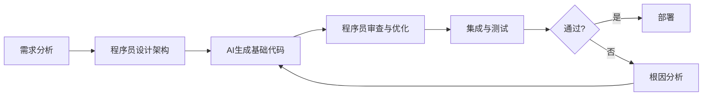

# AI 会取代程序员吗？从代码生成到人机协作的深度解析

## 引言

2023年，GitHub Copilot的代码补全功能让无数开发者惊叹，GPT-4更是能直接生成完整的函数甚至项目骨架。一时间，“AI将取代程序员”的论调甚嚣尘上。然而，当我们深入探究AI在软件工程中的实际表现时，会发现事情远非如此简单。本文将抛开情绪化的讨论，从技术细节出发，分析AI在代码生成、调试、架构设计等环节的真实能力，并探讨程序员在AI时代应如何定位自己。

## AI编程工具的能力边界：代码生成并非万能的

### 1. 模式匹配 vs. 逻辑推理

当前主流AI编程工具（如GitHub Copilot、Codeium）本质上是基于大规模代码库训练的语言模型。它们擅长**模式匹配**：当用户输入函数名或注释时，模型根据上下文推断出最可能的代码片段。例如：

```python
# 输入注释
def calculate_interest(principal, rate, time):
    """
    计算复利
    """
    # AI 自动补全
    amount = principal * (1 + rate) ** time
    return amount
```

这种场景下，AI的表现堪称完美。但当面对需要复杂逻辑推理或领域特有算法时，AI往往会生成看似合理但存在逻辑漏洞的代码。例如，要求AI实现一个**线程安全的LRU缓存**：

```python
# AI生成的错误示例（存在竞态条件）
class LRUCache:
    def __init__(self, capacity):
        self.capacity = capacity
        self.cache = {}
        self.order = []
    
    def get(self, key):
        if key in self.cache:
            self.order.remove(key)
            self.order.append(key)
            return self.cache[key]
        return -1
    
    def put(self, key, value):
        if key in self.cache:
            self.order.remove(key)
        elif len(self.cache) >= self.capacity:
            oldest = self.order.pop(0)
            del self.cache[oldest]
        self.cache[key] = value
        self.order.append(key)
```

这段代码在单线程下看似正确，但缺少锁机制，**在多线程环境下会因列表操作非原子性导致数据不一致**。AI可以模仿LRU缓存的模式，却很难自动添加`threading.Lock`并理解锁的粒度。

### 2. 上下文理解与项目级架构

AI的另一个短板是**缺乏对大型项目的全局认知**。它能看到当前文件或附近几个文件的上下文，但无法理解整个微服务架构中模块间的依赖关系、数据库事务边界或业务领域的隐式规则。例如，当一个电商系统要求“订单创建后发送优惠券”时，AI可能只生成发送消息的代码，而忽略了需要**保证分布式事务最终一致性**的关键设计。

## 实际应用场景：AI作为高效副驾驶

与其担心被取代，不如将AI视为**生产力倍增器**。以下三个场景最能体现AI的价值：

### 场景一：样板代码与单元测试生成

在编写CRUD接口或数据模型时，重复性工作占比极高。AI可以大幅缩短这部分时间：

```python
# 用户输入：Django模型定义
class Product(models.Model):
    name = models.CharField(max_length=200)
    price = models.DecimalField(max_digits=10, decimal_places=2)
    stock = models.IntegerField(default=0)
    
# AI 自动生成对应的序列化器和视图
from rest_framework import serializers, viewsets

class ProductSerializer(serializers.ModelSerializer):
    class Meta:
        model = Product
        fields = '__all__'

class ProductViewSet(viewsets.ModelViewSet):
    queryset = Product.objects.all()
    serializer_class = ProductSerializer
```

对于单元测试，AI能根据函数签名和文档自动生成边界测试用例：

```python
# 函数定义
def divide(a: float, b: float) -> float:
    """除法运算，b不能为0"""
    if b == 0:
        raise ValueError("除数不能为0")
    return a / b

# AI 生成的测试用例
import pytest

def test_divide_normal():
    assert divide(10, 2) == 5.0

def test_divide_by_zero():
    with pytest.raises(ValueError, match="除数不能为0"):
        divide(10, 0)

def test_divide_negative():
    assert divide(-6, 3) == -2.0
```

### 场景二：代码审查与Bug检测

AI可以充当**静态分析工具**的增强版。例如，使用GPT-4审查一段可能存在内存泄漏的C++代码：

```cpp
// 原始代码
void processData() {
    char* buffer = new char[1024];
    // 一些处理逻辑...
    if (error_condition) {
        return;  // 忘记delete buffer
    }
    delete[] buffer;
}

// AI审查意见：
// 风险：在error_condition为真时，buffer未被释放，导致内存泄漏。
// 建议：使用std::vector<char>或智能指针std::unique_ptr<char[]>管理内存。
```

### 场景三：技术债务重构辅助

当需要将遗留的JavaScript回调函数重构为异步/await时，AI能识别模式并自动转换：

```javascript
// 原始回调地狱
function getUser(id, callback) {
    db.query('SELECT * FROM users WHERE id = ?', [id], (err, result) => {
        if (err) return callback(err);
        callback(null, result);
    });
}

// AI 重构为 async/await
async function getUser(id) {
    try {
        const result = await db.query('SELECT * FROM users WHERE id = ?', [id]);
        return result;
    } catch (err) {
        throw err;
    }
}
```

## 程序员的核心竞争力：AI无法替代的领域

### 1. 复杂系统设计与架构决策

AI可以生成微服务代码，但无法决定**服务拆分粒度**、**数据库选型（SQL vs NoSQL）** 或**缓存策略（本地缓存 vs 分布式缓存）**。这些决策需要理解业务场景、数据一致性要求、团队能力等非结构化信息。例如，设计一个实时竞价系统时，程序员需要权衡使用Redis的乐观锁还是Pessimistic Lock，这涉及对业务并发峰值和失败容忍度的深度理解。

### 2. 业务需求与代码的映射能力

将模糊的业务需求转化为可执行的代码逻辑，是程序员的核心价值。例如，当产品经理说“用户需要看到附近的朋友”时，AI只会生成一个基于经纬度的SQL查询，但程序员需要思考：如何处理用户位置隐私？是否需要地理围栏？如何优化大量用户时的性能？这些**隐式需求**的挖掘，AI目前无法胜任。

### 3. 调试与根因分析

AI生成的代码出错时，程序员需要具备**逆向推理**能力。例如，一个分布式系统的间歇性超时问题，可能涉及网络抖动、GC暂停、数据库连接池耗尽等多个因素。AI可以给出常见原因列表，但无法像经验丰富的程序员那样，通过监控日志、线程dump、CPU火焰图等工具进行**多维度交叉验证**。

## 未来工作模式：人机协作的新范式

我们可以预见，未来软件工程将演变为**程序员 + AI Agent**的协作模式：

- **初级程序员**：大量使用AI生成代码，但需要具备判断代码质量的能力，避免引入安全漏洞或性能瓶颈。
- **高级程序员**：专注于系统架构、非功能性需求（安全、性能、可扩展性）以及AI无法处理的复杂业务逻辑。
- **AI提示工程师**：专门优化与AI的交互，设计高质量的prompt以获取更准确的代码生成结果。

例如，一个高效的协作流程可能是：



## 结论：取代的不是程序员，而是不会使用AI的程序员

回到最初的问题：AI会取代程序员吗？答案是**不会完全取代，但会深刻改变这个职业**。就像计算器没有取代数学家，而是让数学家能专注于更抽象的理论研究；AI将把程序员从繁琐的“编码苦力”中解放出来，让他们有更多精力投入到创造性工作中。

**建议程序员立即采取的行动：**
1. **掌握AI辅助工具**：熟练使用GitHub Copilot、Cursor IDE或通义灵码。
2. **提升架构思维**：学习分布式系统设计、领域驱动设计等高级主题。
3. **强化调试能力**：培养系统性排查问题的能力，这是AI的薄弱环节。
4. **关注AI局限性**：了解当前AI在逻辑推理、上下文理解方面的边界，避免过度依赖。

最终，那些将AI视为“副驾驶”而非“替代者”的程序员，将在新一轮技术浪潮中占据先机。